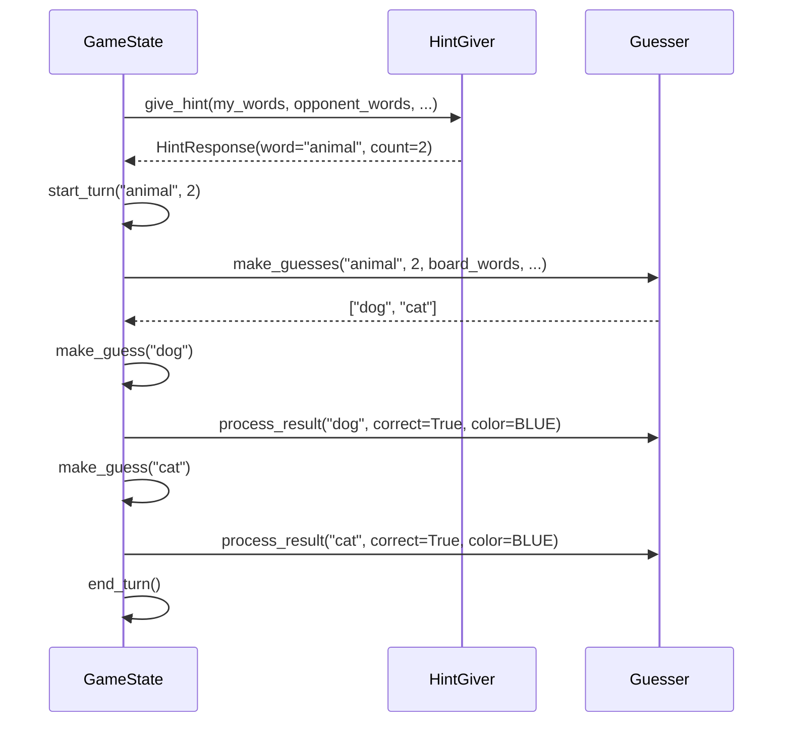

## Overview

Agents in this benchmark implement two distinct roles from the Codenames game: the **HintGiver** (spymaster) who sees all card colors, and the **Guesser** (field operative) who only sees words. This separation tests different AI capabilities and enables benchmarking of cross-model coordination.

<Info>
Agent implementations are in the `agents/` directory. The base interfaces are in `agents/base.py`, and LLM agents use BAML in `agents/llm/baml_agents.py`.
</Info>

## Agent Interfaces

### HintGiver (Spymaster)

The HintGiver sees all word colors and must give one-word hints to guide the Guesser.

```python agents/base.py
from agents.base import HintGiver, HintResponse
from game import Team
from typing import List

class HintGiver(ABC):
    def __init__(self, team: Team):
        self.team = team
    
    @abstractmethod
    def give_hint(
        self,
        my_words: List[str],          # Your team's unrevealed words
        opponent_words: List[str],     # Opponent's unrevealed words
        neutral_words: List[str],      # Neutral unrevealed words
        bomb_words: List[str],         # Bomb words (AVOID!)
        revealed_words: List[str],     # Already guessed words
        board_words: List[str]         # All words on board
    ) -> HintResponse:                 # Returns (word, count)
        pass
```

#### HintResponse Structure

```python agents/base.py
@dataclass
class HintResponse:
    word: str   # Single word hint (no spaces)
    count: int  # How many words it relates to (1-9)
    
    def validate(self) -> Tuple[bool, str]:
        # Validates hint format and constraints
        pass
```

<Warning>
**Hint Rules:**
- Must be a single word (no spaces)
- Cannot be any word currently on the board
- Count indicates how many of your team's words relate to the hint
</Warning>

### Guesser (Field Operative)

The Guesser only sees words (not colors) and must guess based on hints.

```python agents/base.py
from agents.base import Guesser
from game import Team, CardColor
from typing import List

class Guesser(ABC):
    def __init__(self, team: Team):
        self.team = team
    
    @abstractmethod
    def make_guesses(
        self,
        hint_word: str,               # The hint word
        hint_count: int,              # How many words it relates to
        board_words: List[str],       # All words on board
        revealed_words: List[str]     # Already revealed words
    ) -> List[str]:                   # Words to guess (ordered)
        pass
    
    def process_result(self, guessed_word: str, was_correct: bool, color: CardColor):
        # Optional: receive feedback after each guess
        pass
    
    def reset(self):
        # Optional: clear state between games
        pass
```

<Info>
**Guessing Strategy:**
- Can guess 0 to `hint_count + 1` words
- Standard: guess up to `hint_count` words
- Extra guess allowed for leveraging previous hints
- Turn ends immediately on wrong guess
</Info>

## Agent Types

### BAML Agents (Recommended)

Universal LLM agents that work with any model provider using BAML for type-safe structured outputs.

```python agents/llm/baml_agents.py
from agents.llm import BAMLHintGiver, BAMLGuesser, BAMLModel
from game import Team

# Create agents with specific models
hint_giver = BAMLHintGiver(Team.BLUE, model=BAMLModel.GPT4O_MINI)
guesser = BAMLGuesser(Team.RED, model=BAMLModel.CLAUDE_SONNET_45)
```

#### Available Models

The `BAMLModel` enum includes 50+ models across multiple providers:

<Tabs>
  <Tab title="OpenAI">
    ```python
    # GPT-5 Series (Latest)
    BAMLModel.GPT5
    BAMLModel.GPT5_MINI
    BAMLModel.GPT5_NANO
    BAMLModel.GPT5_CHAT
    BAMLModel.GPT5_PRO
    
    # GPT-4.1 Series
    BAMLModel.GPT41
    BAMLModel.GPT41_MINI
    BAMLModel.GPT41_NANO
    
    # Reasoning Models
    BAMLModel.O4_MINI
    BAMLModel.O3_MINI
    BAMLModel.O3
    BAMLModel.O1
    BAMLModel.O1_MINI
    BAMLModel.O1_PREVIEW
    
    # GPT-4o Series
    BAMLModel.GPT4O
    BAMLModel.GPT4O_MINI
    BAMLModel.GPT4O_20240806
    BAMLModel.GPT4O_MINI_20240718
    
    # Legacy GPT-4
    BAMLModel.GPT4_TURBO
    BAMLModel.GPT4
    BAMLModel.GPT4_32K
    ```
  </Tab>
  
  <Tab title="Anthropic">
    ```python
    # Claude 4.5 Series (Latest)
    BAMLModel.CLAUDE_SONNET_45  # 1M context
    BAMLModel.CLAUDE_HAIKU_45   # Fast & affordable
    
    # Claude 4.x Series
    BAMLModel.CLAUDE_OPUS_41    # Most capable
    BAMLModel.CLAUDE_SONNET_4
    BAMLModel.CLAUDE_OPUS_4
    
    # Claude 3.x Series
    BAMLModel.CLAUDE_SONNET_37
    BAMLModel.CLAUDE_HAIKU_35
    BAMLModel.CLAUDE_HAIKU_3
    ```
  </Tab>
  
  <Tab title="Google">
    ```python
    # Gemini 2.5 Series
    BAMLModel.GEMINI_25_PRO
    BAMLModel.GEMINI_25_FLASH
    BAMLModel.GEMINI_25_FLASH_LITE
    
    # Gemini 2.0 Series
    BAMLModel.GEMINI_20_FLASH
    BAMLModel.GEMINI_20_FLASH_LITE
    ```
  </Tab>
  
  <Tab title="Other">
    ```python
    # DeepSeek
    BAMLModel.DEEPSEEK_CHAT      # V3.2 non-thinking
    BAMLModel.DEEPSEEK_REASONER  # V3.2 thinking mode
    
    # xAI Grok 4
    BAMLModel.GROK4
    BAMLModel.GROK4_FAST_REASONING
    BAMLModel.GROK4_FAST_NON_REASONING
    
    # xAI Grok 3
    BAMLModel.GROK3
    BAMLModel.GROK3_FAST
    BAMLModel.GROK3_MINI
    
    # Meta Llama
    BAMLModel.LLAMA
    
    # OpenRouter (Free Models!)
    BAMLModel.OPENROUTER_DEVSTRAL
    BAMLModel.OPENROUTER_MIMO_V2_FLASH
    BAMLModel.OPENROUTER_NEMOTRON_NANO
    BAMLModel.OPENROUTER_DEEPSEEK_R1T_CHIMERA
    BAMLModel.OPENROUTER_GLM_45_AIR
    BAMLModel.OPENROUTER_LLAMA_33_70B
    ```
  </Tab>
</Tabs>

#### BAML Agent Benefits

<CardGroup cols={2}>
  <Card title="Type-Safe Outputs" icon="shield-check">
    Automatic validation of LLM responses with retry logic for malformed JSON
  </Card>
  
  <Card title="Single Implementation" icon="code">
    One agent class works with all providers—no per-provider code
  </Card>
  
  <Card title="Declarative Prompts" icon="file-code">
    Edit prompts in `.baml` files, not Python strings
  </Card>
  
  <Card title="Interactive Testing" icon="play">
    Test prompts in the BAML Playground before running benchmarks
  </Card>
</CardGroup>

### Random Agents

Simple baseline agents for testing without LLM costs:

```python agents/random_agents.py
from agents.random_agents import RandomHintGiver, RandomGuesser
from game import Team

hint_giver = RandomHintGiver(Team.BLUE)
guesser = RandomGuesser(Team.BLUE)
```

Random agents:
- **HintGiver**: Selects random hint words and counts
- **Guesser**: Randomly selects from unrevealed words
- Useful for baseline performance comparisons

## Factory Functions

For easier agent creation, use factory functions:

```python agents/llm/baml_agents.py
from agents.llm import create_hint_giver, create_guesser
from game import Team

# Create by provider name
hint_giver = create_hint_giver("openai", "gpt-4o", Team.BLUE)
guesser = create_guesser("anthropic", team=Team.RED)  # Uses default model

# Provider/model mapping
hint_giver = create_hint_giver("google", "gemini-2.5-flash", Team.BLUE)
```

### Provider Defaults

| Provider | Default Model |
|----------|---------------|
| `openai` | `gpt-4o-mini` |
| `anthropic` | `claude-haiku-4-5` |
| `google` | `gemini-2.5-flash` |
| `deepseek` | `deepseek-reasoner` |
| `grok` | `grok-4` |
| `llama` | `llama-3.3-70b` |

## Customizing Prompts

BAML agents use prompts defined in `baml_src/main.baml`. You can customize them:

```baml baml_src/main.baml
function GiveHint(
  team: string,
  my_words: string[],
  opponent_words: string[],
  neutral_words: string[],
  bomb_words: string[],
  revealed_words: string[]
) -> HintResponse {
  client GPT4oMini

  prompt #"
    You are playing Codenames as the {{ team | upper }} team's spymaster.

    YOUR GOAL: Give a one-word hint and a number to help your teammate.

    YOUR TEAM'S WORDS:
    {{ my_words | join(', ') }}

    OPPONENT'S WORDS (avoid):
    {{ opponent_words | join(', ') }}

    BOMB WORD(S) (NEVER hint at these):
    {{ bomb_words | join(', ') }}

    // Add your custom strategy instructions here
    STRATEGY:
    - Look for semantic clusters
    - Balance safety vs. aggressiveness
    - Avoid risky hints near the bomb

    {{ ctx.output_format }}
  "#
}
```

After editing, regenerate the client:

```bash
baml generate
```

<Tip>
See the [BAML Integration](/concepts/baml) page for more details on prompt engineering and testing.
</Tip>

## Agent Communication Flow

Here's how agents interact during a game:



<Steps>
  <Step title="HintGiver Analyzes Board">
    Receives word lists categorized by color and selects a strategic hint
  </Step>
  
  <Step title="Game Starts Turn">
    Validates hint and begins the turn phase
  </Step>
  
  <Step title="Guesser Makes Guesses">
    Receives hint and returns ordered list of guesses
  </Step>
  
  <Step title="Game Processes Guesses">
    Reveals words one at a time, stopping on incorrect guess or bomb
  </Step>
  
  <Step title="Feedback Loop (Optional)">
    Guesser receives result of each guess via `process_result()`
  </Step>
</Steps>

## Design Rationale

### Why Separate HintGiver and Guesser?

This architecture enables testing different aspects of AI capability:

<AccordionGroup>
  <Accordion title="Information Access" icon="eye">
    **HintGiver** has complete information (all colors) and must compress knowledge into a single word.
    
    **Guesser** has incomplete information and must interpret hints correctly.
    
    This tests how well models handle information asymmetry.
  </Accordion>
  
  <Accordion title="Cognitive Skills" icon="brain">
    **HintGiver** needs:
    - Semantic clustering (finding common themes)
    - Risk assessment (avoiding opponent words and bombs)
    - Strategic planning (maximizing points vs. safety)
    
    **Guesser** needs:
    - Semantic reasoning (word associations)
    - Confidence calibration (knowing when to stop)
    - Context integration (using previous hints)
  </Accordion>
  
  <Accordion title="Cross-Model Coordination" icon="handshake">
    You can pair different models as HintGiver and Guesser to test:
    - Which models work well together
    - Communication effectiveness across model families
    - Cost optimization (cheap guesser + expensive hint giver)
  </Accordion>
</AccordionGroup>

### Why process_result()?

The optional `process_result()` callback allows Guessers to:
- Learn within a game (adjust strategy based on outcomes)
- Track performance for analysis
- Implement more sophisticated reasoning

```python agents/llm/baml_agents.py
def process_result(self, guessed_word: str, was_correct: bool, color: CardColor):
    """Track guess results for analysis."""
    self.guess_history.append({
        'word': guessed_word,
        'correct': was_correct,
        'color': color.value
    })
```

## Example: Creating Agent Pairs

```python
from agents.llm import BAMLHintGiver, BAMLGuesser, BAMLModel
from game import Team

# Same model for both roles
blue_hint = BAMLHintGiver(Team.BLUE, model=BAMLModel.GPT4O_MINI)
blue_guess = BAMLGuesser(Team.BLUE, model=BAMLModel.GPT4O_MINI)

# Different models for coordination testing
red_hint = BAMLHintGiver(Team.RED, model=BAMLModel.CLAUDE_SONNET_45)
red_guess = BAMLGuesser(Team.RED, model=BAMLModel.GPT4O)  # Cross-provider!

# Cost optimization: expensive hint giver, cheap guesser
blue_hint = BAMLHintGiver(Team.BLUE, model=BAMLModel.GPT4O)
blue_guess = BAMLGuesser(Team.BLUE, model=BAMLModel.GPT4O_MINI)

# Use free models from OpenRouter
blue_hint = BAMLHintGiver(Team.BLUE, model=BAMLModel.OPENROUTER_DEVSTRAL)
blue_guess = BAMLGuesser(Team.BLUE, model=BAMLModel.OPENROUTER_DEVSTRAL)
```

## Model Name Retrieval

All agents implement `get_model_name()` for result tracking:

```python agents/base.py
def get_model_name(self) -> str:
    """Return the model identifier (e.g., 'GPT4oMini', 'ClaudeSonnet45')."""
    return self.model.value  # For BAML agents
```

This enables:
- Detailed benchmark results per model
- Cost tracking and analysis
- Performance comparisons across models

## Next Steps

<CardGroup cols={2}>
  <Card title="BAML Integration" icon="brackets-curly" href="/concepts/baml">
    Learn how BAML enables type-safe LLM interactions and prompt engineering
  </Card>
  
  <Card title="Running Benchmarks" icon="chart-line" href="/guides/benchmarking">
    Start benchmarking different models and agent configurations
  </Card>
</CardGroup>